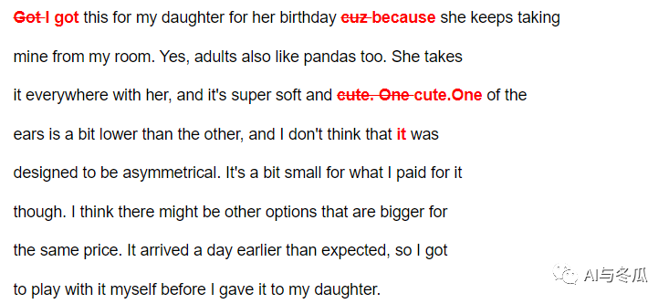

​	上一篇文章我们介绍了大模型中的prompt的基本用法，本节我们将具体介绍prompt在各种任务中的应用。

​	本文以ChatGPT的平替模型claude为例，使用代码来调用slack平台上的claude模型：

```python
import asyncio
from os import getenv
from dotenv import load_dotenv
from slack_sdk.web.async_client import AsyncWebClient
from slack_sdk.errors import SlackApiError

load_dotenv()
CLAUDE_BOT_ID = "member ID"

class SlackClient(AsyncWebClient):
    CHANNEL_ID = None
    LAST_TS = None

    async def chat(self, text):
        if not self.CHANNEL_ID:
            raise Exception("Channel not found.")
        resp = await self.chat_postMessage(channel=self.CHANNEL_ID, text=text)
        # print("c: ", resp)
        self.LAST_TS = resp["ts"]

    async def open_channel(self):
        if not self.CHANNEL_ID:
            # print(111)
            response = await self.conversations_open(users=CLAUDE_BOT_ID)
            self.CHANNEL_ID = response["channel"]["id"]

    async def get_reply(self):
        for _ in range(150):
            try:
                resp = await self.conversations_history(channel=self.CHANNEL_ID, oldest=self.LAST_TS, limit=2)
                # print("r: ", resp)
                pass
                msg = [msg["text"] for msg in resp["messages"] if msg["user"] == CLAUDE_BOT_ID]
                if msg and not msg[-1].endswith("Typing…_"):
                    return msg[-1]
            except (SlackApiError, KeyError) as e:
                # print(f"Get reply error: {e}")
                pass
            await asyncio.sleep(1)
        raise Exception("Get replay timeout")

client = SlackClient(token="token-key")

async def predict(content):
    await client.open_channel()
    await client.chat(content)
    reply = await client.get_reply() 
    print(reply)
```

### **4、摘要任务：**

#### **4.1 生成评论的摘要**

​	假设你正在构建一个电子商务的网站，并且网站上有大量的评论，需要一个工具帮你总结冗长的评论，使你可以更快的浏览更多的评论内容，更好的了解客户的想法。

```python

if __name__ == "__main__":
    seq = """非常差,最差的一次,首先订餐过了1个半小时也没显示送餐,电话去问无论正一味还是百度外卖客服都一问三不知,要求客服回电至今未回,另外正一味的饭也是半生不熟非常差,和上次点的汉拿山的差远了,伤了心了,对百度外卖,我要投诉"""
    prompt = f"你的任务是生成来自某外卖网站的评论的简短摘要，最多30个字。内容：'''{seq}'''"
    # prompt = "/reset"
    loops=asyncio.get_event_loop()
    loops.run_until_complete(asyncio.wait([predict(prompt)]))
```

​	运行以上代码，可以得到以下输出：

```python
订餐超时,饭菜质量差,客服无责任,外卖平台管理有待改进。
```

#### **4.2 指定信息的摘要**

​	如果你想有目的的去总结一段摘要，例如你想向运输部门提供反馈。则可以修改提示来突出这一点，这样就可以使生成的摘要更加适用于业务中的某个特定群体的需求。

```python

if __name__ == "__main__":
    # prompt = "/reset"
    loops=asyncio.get_event_loop()
    loops.run_until_complete(asyncio.wait([predict(prompt)]))
```

​	运行以上代码，输出结果为：

```python
预定外卖超时1.5小时,仍未送达,客服不负责任。
```

#### **4.3 提取指定的信息**

​	在以上的总结中，除了生成与配送相关的信息以外，还有一些其他的信息，你可以要求模型只是提取信息而不是总结信息。

```python
if __name__ == "__main__":
    seq = """非常差,最差的一次,首先订餐过了1个半小时也没显示送餐,电话去问无论正一味还是百度外卖客服都一问三不知,要求客服回电至今未回,另外正一味的饭也是半生不熟非常差,和上次点的汉拿山的差远了,伤了心了,对百度外卖,我要投诉"""
    prompt = f"你的任务是提取来自评论中的关键信息，以便向相关部门反馈，最多30个字。内容：'''{seq}'''"
    # prompt = "/reset"
    loops=asyncio.get_event_loop()
    loops.run_until_complete(asyncio.wait([predict(prompt)]))
```

​	运行以上代码，输出结果为：

```python
"""""1.5小时未送达,客服不负责,投诉外卖平台""""
```

#### **4.4 多条评论的摘要**

​	本节将使用一个具体的例子来说明，如何使用模型来帮助自己总结多篇评论的内容，使其更加容易阅读。

```python
if __name__ == "__main__":
    seq1 = "非常差,最差的一次,首先订餐过了1个半小时也没显示送餐,电话去问无论正一味还是百度外卖客服都一问三不知,要求客服回电至今未回,另外正一味的饭也是半生不熟非常差,和上次点的汉拿山的差远了,伤了心了,对百度外卖,我要投诉"
    seq2 = "送的这是啥啊，饭是夹生的，汤是温的，太能糊弄人了，这是第一次也是最后一次，这要是在店里，肯定要他给我换啊，这送餐还不是饭点呢。无语的狠啊，擦"
    seq3 = "鸡块难吃,速度太慢,花了一个多小时,送到饭都凉了怎么吃"
    seq4 = "配送人员特别准时就到了,然后还顺手帮我带了几个垃圾,其实我很不好意思,祝福这位师傅2016年身体健康工作顺利,谢谢"

    review = [seq1,seq2,seq3,seq4]
    for i in range(len(review)):
        prompt = f"您的任务是生成来自电子商务网站的产品评论的简短摘要。总结下面的评论，最多 20 个单词。内容：'''{review[i]}'''"
        loops=asyncio.get_event_loop()
        loops.run_until_complete(asyncio.wait([predict(prompt,f"{i+1}:")]))
```

​	运行以上代码，输出结果为：

```python
1: 外卖迟到,菜质差,客服不负责,投诉管理需改进。

2: 送餐差,菜生,汤凉,第一次也是最后,店里肯定换,送餐时间不对,无语。

3: 鸡块难吃,速度慢,送餐时间长,饭菜凉了,难吃。

4: 外卖员服务好,准时送餐,还带走垃圾,谢谢,祝工作顺利。
```

​	关于摘要任务就介绍到这里，如果你有大量的文本，则可以使用这样的提示来进行总结，以帮助人们快速的了解文本中的内容，必要时可选择性的提取更多的特定信息。

### **5、推理任务**

#### **5.1 情感分析**

​	如果你想做情绪分析的任务，在传统的机器学习中，你必须收集标签数据集，并训练一个模型进行预测。大语言模型的好处是，对于这样的任务，你只需要编写一个提示，就可以让它马上生成结果。

```python

if __name__ == "__main__":
    seq = "太慢了，10点多定的，1点15送到的。本来想取消订单，需要打电话取消。我打了，人家说需要换另外一个号，他们不负责取消。然后我又打了另外的号码，一位女士接的，我说我要取消，她说经理不在，她不管。说完她直接就挂了。。。牛逼~"

    prompt = f"以下外卖评论的情绪是什么。评论内容：'''{seq}'''"
    loops=asyncio.get_event_loop()
    loops.run_until_complete(asyncio.wait([predict(prompt)])
```

​	运行以上代码，可得到如下输出：

```python
该评论表达的情绪是不满和愤怒。评论提到订餐时间长达3个多小时,想取消订单但客服不负责也不配合,最后直接挂电话,这些都显示消费者的不满意和愤怒。
```

#### **5.2 控制输出的样式**

​	如果你想得到更简洁的回答可以在这个提示中添加另一条指令，用一个单词给出答案。

```python
if __name__ == "__main__":
    seq = "太慢了，10点多定的，1点15送到的。本来想取消订单，需要打电话取消。我打了，人家说需要换另外一个号，他们不负责取消。然后我又打了另外的号码，一位女士接的，我说我要取消，她说经理不在，她不管。说完她直接就挂了。。。牛逼~"

    prompt = f"以下外卖评论的情绪是什么，请用一个单词回答，例如正面或负面。评论内容：'''{seq}'''"
    loops=asyncio.get_event_loop()
    loops.run_until_complete(asyncio.wait([predict(prompt)]))
```

​	运行以上代码，输出如下：

```python
负面。
```

​	我们使用另外一个提示，让模型总结出作者所表达的情绪列表

```python
if __name__ == "__main__":
    seq = "太慢了，10点多定的，1点15送到的。本来想取消订单，需要打电话取消。我打了，人家说需要换另外一个号，他们不负责取消。然后我又打了另外的号码，一位女士接的，我说我要取消，她说经理不在，她不管。说完她直接就挂了。。。牛逼~"

    prompt = f"以下外卖评论的情绪是什么，请给出情绪列表，要求不超过五项。评论内容：'''{seq}'''"
    loops=asyncio.get_event_loop()
    loops.run_until_complete(asyncio.wait([predict(prompt)]))
```

​	运行以上代码，可得到如下输出：

```python
情绪列表:
不满,愤怒,厌恶,无语,挫败。 
```

#### **5.3 输出json格式**

​	在这个例子中，你可以要求模型以json的格式输出，并要求返回的关键字名称。

```python
if __name__ == "__main__":
    seq = "太慢了，10点多定的，1点15送到的。本来想取消订单，需要打电话取消。我打了，人家说需要换另外一个号，他们不负责取消。然后我又打了另外的号码，一位女士接的，我说我要取消，她说经理不在，她不管。说完她直接就挂了。。。牛逼~"

    prompt = f"从评论中识别以下要素 \
    1、情绪（积极或消极） \
    2、评论者是否愤怒（是或否） \
    3、评论者购买的物品 \
    请使用json格式进行返回，关键字为'Sentiment', 'Anger'以及'Item' 尽可能简短地回答。\
    将Anger设为布尔值。\
    '''{seq}'''"
    loops=asyncio.get_event_loop()
    loops.run_until_complete(asyncio.wait([predict(prompt)]))
```

​	运行以上代码，输出如下：

```python
 {"Sentiment": "消极", "Anger": true, "Item": "外卖"}
```

#### **5.4 文本主题推断**

​	当给定一段很长的文本，而你想知道这段文本是关于什么的？有哪些主题时？我们也可以要求大模型来帮助我们进行总结。

```python
if __name__ == "__main__":
    story = """在政府最近进行的一项调查中，公共部门的员工被要求对他们工作的部门的满意度进行评分。结果显示，美国国家航空航天局是最受欢迎的部门，满意度为95%。美国国家航空宇航局的一名员工John Smith对调查结果发表了评论，他说：，“我对美国国家航空航天局脱颖而出并不感到惊讶。这是一个与优秀的人才和令人难以置信的机会合作的好地方。我很自豪能成为这样一个创新组织的一员。
”这一结果也受到了美国航空航天局管理团队的欢迎，局长汤姆·约翰逊表示，“我们很高兴听到我们的员工对他们在美国国家航空航天局的工作感到满意。我们有一支才华横溢、敬业的团队，他们为实现我们的目标不懈努力，看到他们的辛勤工作得到了回报，真是太棒了。
”调查还显示，社会保障管理局的满意度最低，只有45%的员工表示他们对自己的工作感到满意。政府承诺解决员工在调查中提出的担忧，并努力提高所有部门的工作满意度。"""
    prompt = f"确定以下文本中正在讨论的五个主题，每个主题用一到两个单词进行描述，并用逗号分隔。文章内容'''{story}'''"
    loops=asyncio.get_event_loop()
    loops.run_until_complete(asyncio.wait([predict(prompt)]))
```

​	运行以上代码，可得到如下输出：

```python
满意度,美国国家航空航天局,团队,目标,担忧,社会安全
```

#### **5.5 文本主题索引**

​	如果你有一个文章的集合，并想提取主题，那么还可以使用大模型来帮助你索引不同的主题。

```python
if __name__ == "__main__":
    topic = ["美国国家航空航天局","地方政府","工程","员工满意度","联邦政府"]
    story = """在政府最近进行的一项调查中，公共部门的员工被要求对他们工作的部门的满意度进行评分。结果显示，美国国家航空航天局是最受欢迎的部门，满意度为95%。美国国家航空宇航局的一名员工John Smith对调查结果发表了评论，他说：，“我对美国国家航空航天局脱颖而出并不感到惊讶。这是一个与优秀的人才和令人难以置信的机会合作的好地方。我很自豪能成为这样一个创新组织的一员。
”这一结果也受到了美国航空航天局管理团队的欢迎，局长汤姆·约翰逊表示，“我们很高兴听到我们的员工对他们在美国国家航空航天局的工作感到满意。我们有一支才华横溢、敬业的团队，他们为实现我们的目标不懈努力，看到他们的辛勤工作得到了回报，真是太棒了。
”调查还显示，社会保障管理局的满意度最低，只有45%的员工表示他们对自己的工作感到满意。政府承诺解决员工在调查中提出的担忧，并努力提高所有部门的工作满意度。"""
    prompt = f"""
    请判断列表中的主题是否为文章的主题。
    以列表形式给出答案，每个主题用0或1表示是否符合，并返回json格式。
    列表内容：{",".join(topic)}
    文章内容'''{story}'''"""
    loops=asyncio.get_event_loop()
    loops.run_until_complete(asyncio.wait([predict(prompt)]))
```

​	运行以上代码，输出如下：

```python
{"美国国家航空航天局":1,"地方政府":0,"工程":0,"员工满意度":1,"联邦政府":0}
```

### **6、转换任务**

​	大模型非常擅长将输入转换为不同的格式，例如输入一种语言的文本，并将其转换或翻译为另外一种语言，或者帮助作者进行拼写和语法的纠正和检查。

### **6.1 翻译任务**

​	大型的语言模型是在大量文本上训练出来的，其中很多内容来自于互联网，包含了许多不同的语言。因此，模型以不同的程度熟练的掌握了数百种语言。我们将通过一些例子来介绍如何使用这种能力。

​	在第一个例子中，我们将要求模型将英文翻译成西班牙语。

```python
if __name__ == "__main__":
    seq = "Hi, I would like to order a blender"
    prompt = f"""Translate the following English text to Spanish'''{seq}'''"""
    loops=asyncio.get_event_loop()
    loops.run_until_complete(asyncio.wait([predict(prompt)]))
```

​	运行以上代码，输出如下：

```python
Hola, me gustaría ordenar una licuadora.
```

​	下面我们将尝试另外一个例子，这个例子中我们让模型告诉我们这是什么语言。

```python
if __name__ == "__main__":
    seq = "Combien coûte le lampadaire?"
    prompt = f"""Tell me which language this is: '''{seq}'''"""
    loops=asyncio.get_event_loop()
    loops.run_until_complete(asyncio.wait([predict(prompt)]))
```

​	运行以上代码，输出如下：

```python
This text is in French.
```

​	模型也可以同时进行多种翻译。在下边这个例子中，我们将要求模型将文本翻译成中文、法语和西班牙语。

```python
if __name__ == "__main__":
    seq = "I want to order a basketball"
    prompt = f"""Translate the following text to French and Spanish
and Chinese: \
    '''{seq}'''"""
    loops=asyncio.get_event_loop()
    loops.run_until_complete(asyncio.wait([predict(prompt)]))
```

​	运行以上代码，输出如下：

```python
French: Je veux commander un basket-ball. 
Spanish: Quiero ordenar un balón de baloncesto.
Chinese: 我想订购一个篮球。
```

#### **6.2 通用翻译**

​	假设你在负责一家跨国的电商公司，用户发来的信息将是各种不同的语言，因此，我们将需要一个通用的翻译器。

~~~python

if __name__ == "__main__":
    
    user_messages = [
    "La performance du système est plus lente que d'habitude.", # System performance is slower than normal 
    "Mi monitor tiene píxeles que no se iluminan.", # My monitor has pixels that are not lighting
    "Il mio mouse non funziona", # My mouse is not working
    "Mój klawisz Ctrl jest zepsuty", # My keyboard has a broken control key
    "我的屏幕在闪烁" # My screen is flashing
    ]
    
    for issue in user_messages:
        prompt = f"请告诉我这是什么语言: ```{issue}```"
        print(prompt)
        loops=asyncio.get_event_loop()
        loops.run_until_complete(asyncio.wait([predict(prompt)]))
        prompt = f"""将文本翻译成英语和中文 \
        ```{issue}```"""
        loops=asyncio.get_event_loop()
        loops.run_until_complete(asyncio.wait([predict(prompt)]))
~~~

​	运行以上代码，输出如下：

```python

请告诉我这是什么语言: ```La performance du système est plus lente que d'habitude.```
 这是法语。

 英语:The system performance is slower than usual.
中文:系统性能比平常慢。

请告诉我这是什么语言: ```Mi monitor tiene píxeles que no se iluminan.```
 这是西班牙语。

 英语:My monitor has pixels that do not illuminate. 
中文:我的显示器有不亮的像素。

请告诉我这是什么语言: ```Il mio mouse non funziona```
 这是意大利语。

 英语:My mouse does not work.
中文:我的鼠标不工作。

请告诉我这是什么语言: ```Mój klawisz Ctrl jest zepsuty```
 这是波兰语。

 英语:My Ctrl key is broken. 
中文:我的Ctrl键坏了。

请告诉我这是什么语言: ```我的屏幕在闪烁```
 这是中文。

 英语:My screen is flashing.
中文:我的屏幕在闪烁。
```

#### **6.3 风格转换**

​	写作的风格会根据受众的不同而变换，例如当我给教授写邮件时的风格显然与我给我弟弟发短信的方式大不相同，我们可以利用大模型帮助我们将文本转换成不同的风格。

~~~python
if __name__ == "__main__":
    seq="哥们，我是韩，帮我看一下这款台灯的风格怎么样？"
    prompt = f"""将文本转换成商务邮件的格式 \
        ```{seq}```"""
    loops=asyncio.get_event_loop()
    loops.run_until_complete(asyncio.wait([predict(prompt)]))
~~~

​	运行以上代码，输出如下：

```python
尊敬的韩先生, 

您好!我是您的助手机器人。您刚才发送的消息内容如下:

哥们,我是韩,帮我看一下这款台灯的风格怎么样?

我已把上述内容转换成较为正式的商务邮件格式。如需更正或需要进一步说明,请您回复此邮件。

此致
敬礼

助手机器人
```

#### **6.4 文本格式转换**

​	大模型非常擅长在不同的文本格式之间进行转换，例如将json转换成HTML、XML、MarkDown等。

```python
if __name__ == "__main__":
    data_json = { "resturant employees" :[ 
        {"name":"Shyam", "email":"shyamjaiswal@gmail.com"},
        {"name":"Bob", "email":"bob32@gmail.com"},
        {"name":"Jai", "email":"jai87@gmail.com"}
        ]}
    prompt = f"""将下面json格式的文本转换成HTML的格式 \
        文本内容：```{data_json}```"""
    # prompt = "/reset"
    loops=asyncio.get_event_loop()
    loops.run_until_complete(asyncio.wait([predict(prompt)]))
```

​	运行以上代码，输出如下：

```python
这里是转换后的HTML格式:
<table>
<tr>
<th>resturant employees</th>
</tr>
<tr>
<td>
<table>
<tr>
<th>name</th> <th>email</th>
</tr>
<tr>
<td>Shyam</td>
<td><a href="mailto:shyamjaiswal@gmail.com">shyamjaiswal@gmail.com</a></td>
</tr>
<tr>
<td>Bob</td>
<td><a href="mailto:bob32@gmail.com">bob32@gmail.com</a></td>
</tr>
<tr>
<td>Jai</td>
<td><a href="mailto:jai87@gmail.com">jai87@gmail.com</a></td>
</tr>
</table>
</td>
</tr>
</table>
```

#### **6.5 拼写、语法检查**

​	大模型还有一个非常炫酷的功能，即对文本的拼写和语法进行检查。

```python
if __name__ == "__main__":
    text = f"""
    Got this for my daughter for her birthday cuz she keeps taking \
    mine from my room. Yes, adults also like pandas too. She takes \
    it everywhere with her, and it's super soft and cute. One of the \
    ears is a bit lower than the other, and I don't think that was \
    designed to be asymmetrical. It's a bit small for what I paid for it \
    though. I think there might be other options that are bigger for \
    the same price. It arrived a day earlier than expected, so I got \
    to play with it myself before I gave it to my daughter.
    """
    prompt = f"校正并输出正确的文本: ```{text}```"
    # prompt = "/reset"
    loops=asyncio.get_event_loop()
    loops.run_until_complete(asyncio.wait([predict(prompt)]))
```

​	运行以上代码，输出如下：

```python
这里是校正后的正确文本:

I got this for my daughter for her birthday because she keeps taking mine from my room. 
Yes, adults also like pandas too. 
She takes it everywhere with her, and it's super soft and cute.
One of the ears is a bit lower than the other, 
and I don't think that it was designed to be asymmetrical. 
It's a bit small for what I paid for it though. 
I think there might be other options that are bigger for 
the same price. It arrived a day earlier than expected, 
so I got to play with it myself before I gave it to my daughter.
```

​	我们看一下更加直观的结果：

```python
from redlines import Redlines
from IPython.display import display, Markdown, Latex, HTML, JSON
text = """Got this for my daughter for her birthday cuz she keeps taking 
    mine from my room. Yes, adults also like pandas too. She takes 
    it everywhere with her, and it's super soft and cute. One of the 
    ears is a bit lower than the other, and I don't think that was 
    designed to be asymmetrical. It's a bit small for what I paid for it 
    though. I think there might be other options that are bigger for 
    the same price. It arrived a day earlier than expected, so I got 
    to play with it myself before I gave it to my daughter."""
response="""I got this for my daughter for her birthday because she keeps taking 
    mine from my room. Yes, adults also like pandas too. She takes 
    it everywhere with her, and it's super soft and cute.One of the 
    ears is a bit lower than the other, and I don't think that it was 
    designed to be asymmetrical. It's a bit small for what I paid for it 
    though. I think there might be other options that are bigger for 
    the same price. It arrived a day earlier than expected, so I got 
    to play with it myself before I gave it to my daughter."""
diff = Redlines(text,response)
display(Markdown(diff.output_markdown))
```

​	运行以上代码，结果如下图所示：



### **7、扩充任务**

​	扩充任务是指，将一小段简短的文本，或者一组说明或一段主题列表，用大模型生成一段更长的文本，例如生成关于某个主题的电子邮件或文章。

​	本节内容将使用**OpenAi**中的**"gpt-3.5-turbo"**模型作为演示，配置代码如下：

```python
import openai

openai.api_key = "sk-***zbK7"

def get_completion(prompt, model="gpt-3.5-turbo", temperature=0): 
    messages = [{"role": "user", "content": prompt}]
    response = openai.ChatCompletion.create(
    model=model,
    messages=messages,
    temperature=temperature, 
    )
    return response.choices[0].message["content"]
```

#### **7.1 AI自动回复邮件**

​	假设我们要为客户的评论写一封电子邮件进行回复：

```python
if __name__ == "__main__":
    sentiment = "消极"
    review = """太慢了，10点多定的，1点15送到的。本来想取消订单，需要打电话取消。我打了，人家说需要换另外一个号，他们不负责取消。然后我又打了另外的号码，一位女士接的，我说我要取消，她说经理不在，她不管。说完她直接就挂了。。。牛逼~"""
    prompt = f"""
    你是一名客服人工智能助理。
    您的任务是向客户发送电子邮件进行回复。
    如果情绪是积极的或中立的，感谢他们
    如果情绪是消极，请道歉并建议他们可以联系客服。
    确保使用简洁专业的语气写作，并在电子邮件上签名为“AI客户代理”。
    客户评论：'''{review}'''
    客户情绪：{sentiment}
    """
    response = get_completion(prompt)
    print(response)
```

​	运行以上代码，输出如下：

```python

尊敬的客户，

我们非常抱歉您在本次订单中遇到的问题。我们深刻理解您的不满和失望，并向您表示诚挚的歉意。

我们的团队一直在努力提高我们的服务质量，但是我们在这次订单中未能达到您的期望。我们将认真反思您的反馈，并采取措施 
确保这种情况不再发生。

如果您需要取消订单或有任何其他问题，请联系我们的客服团队，他们将竭诚为您服务。我们希望能够重新赢得您的信任和支持 
。

谢谢您对我们的支持和理解。

AI客户代理
```

#### **7.2 温度参数的影响**

​	接下来，本文将介绍大语言模型中的一个参数，简称温度（temperature），它将影响模型生成的多样性，你可以将温度看作模型生成的文本的随机性的程度。

​	例如输入“我最喜欢的食物是......”，假设模型预测的下一个最有可能的单词是“披萨”，其次是“寿司”和“墨西哥卷饼”。因此，在temperature等于0的时候，模型预测的结果是“披萨”，因为在这种情况下，模型总是会选择最有可能的下一个单词。而当temperature大于0的时候，模型选择寿司或者墨西哥卷饼，因为在这种情况下模型会面临更多的选择。


​	我们将上述的例子中的温度因子改变后，观察以下模型的输出结果：

```python
if __name__ == "__main__":
    sentiment = "消极"
    review = """太慢了，10点多定的，1点15送到的。本来想取消订单，需要打电话取消。我打了，人家说需要换另外一个号，他们不负责取消。然后我又打了另外的号码，一位女士接的，我说我要取消，她说经理不在，她不管。说完她直接就挂了。。。牛逼~"""
    prompt = f"""
    你是一名客服人工智能助理。
    您的任务是向客户发送电子邮件进行回复。
    如果情绪是积极的或中立的，感谢他们
    如果情绪是消极，请道歉并建议他们可以联系客服。
    确保使用简洁专业的语气写作，并在电子邮件上签名为“AI客户代理”。
    客户评论：'''{review}'''
    客户情绪：{sentiment}
    """
    response = get_completion(prompt,temperature=0.7)
    print(response)
```

​	运行以上代码，输出如下：

​	第一次运行结果：

```python
尊敬的客户，

我代表我们的公司为您的不便道歉。我们深刻理解您对于订单送货延迟和取消流程的不满。我们将会对此事进行调查和改进，以 
确保未来我们能够为您提供更好的服务。

为了解决您的问题，我们建议您联系我们的客服团队。他们将会为您提供更好的解决方案。如果您有任何进一步的问题，请随时 
联系我们。

我们感谢您对我们的支持和信任。

祝您愉快！

AI客户代理
```

​	第二次运行结果：

```python
尊敬的客户，

我们非常抱歉您对我们的服务感到失望。我们深刻理解您的不满和不便，并为此向您道歉。

我们将尽快调查此事并采取适当的措施，以确保此类问题不再发生。如果您需要进一步的帮助，我们建议您联系我们的客服部门 
。

我们感谢您对我们的支持和理解，希望您能给我们一个机会来重新赢得您的信任。

祝您一切顺利。

AI客户代理
```

​	可以看出，当改变了温度因子的时候，模型的输出变得更加的随机了。你也可以这样认为，在更高的温度因子的条件下，模型会更容易分心，但是会更加的有创造力。

### **8、聊天机器人**

#### **8.1 聊天格式的设计**

​	本节我们来搭建一个点餐机器人，首先我们将定义一个辅助函数：

```python

def get_completion_from_messages(messages, model="gpt-3.5-turbo", temperature=0):
    response = openai.ChatCompletion.create(
    model=model,
    messages=messages,
    temperature=temperature, # this is the degree of randomness of the model's output
    )
    return response.choices[0].message["content"]
```

​	该函数被训练成接受一系列消息作为输入，然后返回模型生成的消息作为输出，例如我们输入一个消息列表，并运行这个函数：

```python
if __name__=="__main__":
    messages = [
        {'role':'system', 'content':'You are an assistant that speaks like Shakespeare.'}, 
        {'role':'user', 'content':'tell me a joke'}, 
        {'role':'assistant', 'content':'Why did the chicken cross the road'}, 
        {'role':'user', 'content':'I don\'t know'}
        ]
    response = get_completion_from_messages(messages,temperature=1)
    print(response)
```

​	该系统消息描述的是，“你是一个说话像莎士比亚的主力”，这是我们告诉模型它该如何表现；然后第一条用户的消息是，“给我讲个笑话”；然后模型向用户提问“你知道鸡为什么过马路吗？”；用户回复“并不知道”。运行以上代码，模型输出如下：

```python
To get to the other side, good sir!
```

​	让我们再次运行这段代码，模型的输出如下：

```python
Verily, forsooth, the chicken crossed the road to get to yonder fairest maiden's fair abode.
```

​	这次的输出是，“诚然，那只小鸡穿过了马路，来到了那边最俊俏的姑娘的精美住处。”，这就是我们需要的莎士比亚式的回应。

#### **8.2 上下文内容**

​	我们再举一个例子，这里系统的消息是“你是一个友好的聊天机器人”，第一条用户的消息是“嗨，我的名字是lisa”

```python
if __name__=="__main__":
    messages = [
        {'role':'system', 'content':'You are friendly chatbot.'}, 
        {'role':'user', 'content':'Hi, my name is Lisa'}
        ]
    response = get_completion_from_messages(messages,temperature=1)
    print(response)
```

​	运行以上代码，输出如下：

```python
Hi Lisa! Nice to meet you. How can I assist you today?
```

​	模型输出为“你好，Lisa，很高兴认识你，今天我可以帮助你吗？”，我们再试另外一个例子，系统消息为“你是一个友好的聊天机器人”，第一条用户的消息为“是的，你能提醒我的名字是什么吗？”

```python
if __name__=="__main__":
    messages = [ 
        {'role':'system', 'content':'You are friendly chatbot.'}, 
        {'role':'user', 'content':'Yes, can you remind me, What is my name?'} 
        ]
    response = get_completion_from_messages(messages,temperature=1)
    print(response)
```

​	运行以上代码，模型的输出如下：

```python
I'm sorry but I don't have access to your name. 
Could you tell me your name so that I can address you properly
```

​	正如你所看到的那样，模型并不知道我的名字。因为与语言模型的交互都是独立的，这意味着你必须提供所有相关的信息，便于模型的使用。

​	如果你想让模型记住前期对话的内容，则必须将上下文传入模型，例如：

```python
if __name__=="__main__":
    messages = [ 
        {'role':'system', 'content':'You are friendly chatbot.'},
        {'role':'user', 'content':'Hi, my name is Lisa'},
        {'role':'assistant', 'content': "Hi Isa! It's nice to meet you. \
        Is there anything I can help you with today?"},
        {'role':'user', 'content':'Yes, you can remind me, What is my name?'}
        ]
    response = get_completion_from_messages(messages,temperature=1)
    print(response)
```

​	运行以上代码，模型的输出如下：

```python
Of course! Your name is Lisa. Is there anything else you need help with?
```

#### **8.3 点餐机器人**

​	这节我们将构建一个点餐机器人（OrderBot），为了构建这个机器人，我们将自动收集用户的提示和助理的响应：

```python
def collect_messages(_):
    prompt = inp.value_input
    inp.value = ''
    context.append({'role':'user', 'content':f"{prompt}"})
    response = get_completion_from_messages(context) 
    context.append({'role':'assistant', 'content':f"{response}"})
    panels.append(
    pn.Row('User:', pn.pane.Markdown(prompt, width=600)))
    panels.append(
    pn.Row('Assistant:', pn.pane.Markdown(response, width=600, styles={'background-color': '#F6F6F6'})))
    return pn.Column(*panels)
```

​	现在我们将设置并运行这个用户界面（UI）来显示订单机器人。其中订单的消息包含了菜单的系统消息。我们每次调用模型的时候，都会使用这个上下文，且这个上下文会随着对话次数不断增加：

```python
import panel as pn # GUI
pn.extension()
panels = [] # collect display 
context = [{'role':'system', 'content':"""
    You are OrderBot, an automated service to collect orders for a pizza res
    taurant. \
    You first greet the customer, then collects the order, \
    and then asks if it's a pickup or delivery. \
    You wait to collect the entire order, then summarize it and check for a 
    final \
    time if the customer wants to add anything else. \
    If it's a delivery, you ask for an address. \
    Finally you collect the payment.\
    Make sure to clarify all options, extras and sizes to uniquely \
    identify the item from the menu.\
    You respond in a short, very conversational friendly style. \
    The menu includes \
    pepperoni pizza 12.95, 10.00, 7.00 \
    cheese pizza 10.95, 9.25, 6.50 \
    eggplant pizza 11.95, 9.75, 6.75 \
    fries 4.50, 3.50 \
    greek salad 7.25 \
    Toppings: \
    extra cheese 2.00, \
    mushrooms 1.50 \
    sausage 3.00 \
    canadian bacon 3.50 \
    AI sauce 1.50 \
    peppers 1.00 \
    Drinks: \
    coke 3.00, 2.00, 1.00 \
    sprite 3.00, 2.00, 1.00 \
    bottled water 5.00 \
    """}] # accumulate messages

inp = pn.widgets.TextInput(value="Hi", placeholder='Enter text here…')
button_conversation = pn.widgets.Button(name="Chat!")
interactive_conversation = pn.bind(collect_messages, button_conversation)
dashboard = pn.Column(inp,pn.Row(button_conversation),pn.panel(interactive_conversation, loading_indicator=True, height=300),)

dashboard
```

​	运行以上代码，输出结果如下：


​	好的，现在你已经建立了自己的点餐聊天机器人。你可以自行地定制这个机器人，可以使用系统消息来改变聊天机器人的行为，让它扮演具有不同知识的不同角色。

###  **9、总结**

​	以上就是大模型中“提示工程”的相关知识点，在本系列的文章中我们介绍了如何构建“提示”的两个关键原则：1）写清晰和具体的指令；2） 给模型思考的时间。并在介绍了大模型在NLP各个任务中的应用。本系列的内容希望能够帮助大家了解大模型的能力以及相关的用法，如果内容中存在错误或纰漏的情况，欢迎大家指正讨论！~